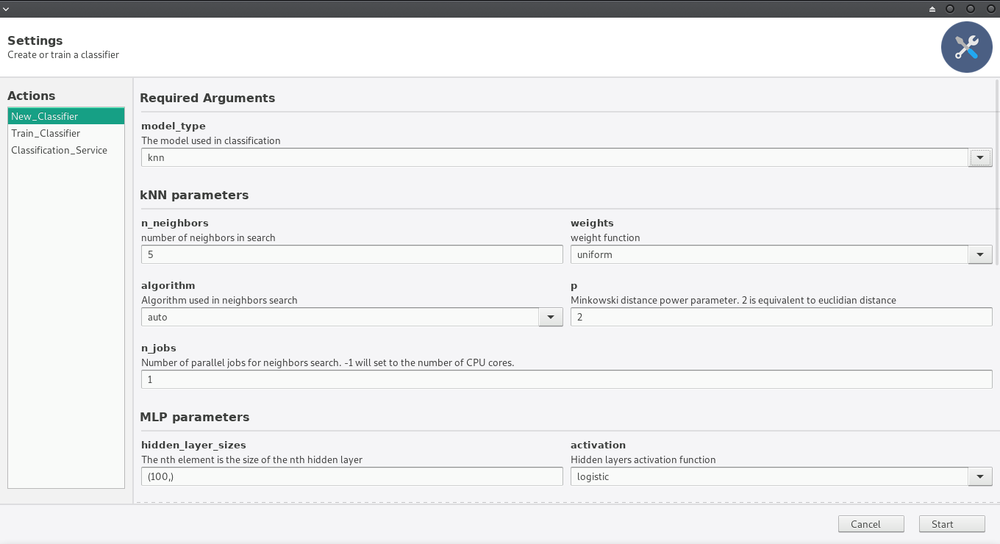

# NeuroWood

NeuroWood é um software para classificação de qualidade da madeira, voltado à soluções para a indústria madeireira e moveleira. Utiliza técnicas de aprendizado de máquina e visão computacional para classificar imagens do fluxo de processos na madeira em tempo real, permitindo tomada de decisão rápida e automática.

## Instalação

### Pré-Requisitos

#### Python 3

Certifique-se de que o Python versão 3 ou superior está disponível no sistema:
```
python3 --version
```
Se necessário, utilize o gerenciador de pacotes do seu sistema operacional ou obtenha a versão do Python mais recente em <https://www.python.org/downloads/>

#### Bibliotecas Python

Utilize o pip para instalar as dependências:
```
sudo python3 -m pip install numpy scipy sklearn scikit-image
sudo python3 -m pip install https://extras.wxpython.org/wxPython4/extras/linux/gtk3/ubuntu-16.04/wxPython-4.0.0b1-cp36-cp36m-linux_x86_64.whl phoenix gooey
```
Pode ser necessário instalar dependências para o módulo wxPython. Elas podem ser verificadas [aqui](https://github.com/wxWidgets/Phoenix/blob/master/README.rst#prerequisites)

### Obtendo o código fonte

Obtenha os arquivos do programa fazendo download do arquivo compactado no diretório do projeto no [github](https://github.com/lprati/neurowood-py), ou então através do comando:
```
git clone https://github.com/lprati/neurowood-py
```
Acesse o diretório e execute o arquivo de código principal para verificar se tudo está funcionando:
```
cd neurowood-py
python3 main.py
```
> Problemas com a instalação? Envie um email: <leonardogiovannip@gmail.com>.

## Primeiros Passos

### Entendendo a interface

#### Escolha da Ação:

Através das escolhas na barra lateral esquerda é possível selecionar a ação desejada.


*    New_Classifier: Permite criar um Classificador, ajustando seus parâmetros e escolhendo um local em disco para armazená-lo como um arquivo.
*    Train_Classifier: Permite selecionar um Classificador existente e submetê-lo à treinamento.
*    Classification_Service: Um Classificador, após a etapa de treinamento, pode classificar imagens obtidas a partir de um dispositivo de captura, ou então, de um diretório em disco (para fins de teste ou demonstração).

#### Escolha dos Parâmetros:

Na área central da primeira tela apresentada, é possivel observar os valores do programa que são configuráveis pelo usuário. Note que nem sempre é necessário preencher todos eles: A maioria possui valores padrão, e não é preciso configurar uma opção que não está sendo utilizada.


> Exemplo: Não é necessário configurar os parâmetros do modelo MLP se estiver utilizando um modelo kNN.

#### Saída do Programa:

Após selecionar uma ação e definir as configurações, clicar no botão "Start", no canto inferior direito, leva à uma segunda tela.


Esta tela apresenta a saída do programa no centro da janela. Informações sobre o processamento da ação solititada ou erros aparecem aqui. No canto inferior direito, uma barra de progresso permite acompanhar o andamento da execução. 

Durante a execução, selecionar o botão "Stop" pára o programa. É possível retornar à tela inicial e escolher uma nova ação, ou novas configurações, escolhendo o botão "Edit". "Restart" repete a última ação selecionada.

### Entendendo as Ações

#### New_Classifier: Criando e configurando um novo classificador

Um Classificador é composto de duas partes principais:
*    Modelo: O modelo estatístico usado para classificação. 
*    Extrator: Um ou mais métodos de extração de característica das imagens.

Comece a configuração do classificador escolhendo um modelo. Os modelos disponíveis na versão atual são dois, knn (k-Nearest Neighbors) e mlp (Multilayer Perceptron).


Logo abaixo, existe uma sessão para configuração de cada modelo.




Em seguida, selecione as técnicas de extração de característica do classificador. Atualmente estão disponíveis duas técnicas, lbp (Local Binary Pattern) e glcm (Gray Level Co-occurrence Matrix).

Por último selecione o local e nome do arquivo destino para salvar o classificador.


Selecione 'Start' para completar a criação. Em seguida, 'Edit' para selecionar a próxima ação.


#### Train_Classifier: Treinando um classificador existente

Dentro desta ação pode-se escolher um modelo previamente salvo para treinamento.


O treinamento dos classificadores envolve ter um conjunto de exemplos para ensinar os modelos. Chama-se estes exemplos de conjunto de treinamento.

No conjunto de treinamento, cada imagem é um exemplo de categoria conhecida. A categoria de uma imagem pertencente ao conjunto de treinamento deve ser indicada pela primeira letra do nome do arquivo. O restante do nome do arquivo de imagem pode seguir o padrão de enumeração que o usuário preferir.

```
Exemplos de nomes válidos:
A001.jpg        --> Exemplar da classe A 
D050318.png     --> Exemplar da classe D
Z-maq2-022.png  --> Exemplar da classe Z
FOOBAR.jpg      --> Exemplar da classe F
```

```
Exemplos de nomes inválidos:
001.jpg         --> Classe não está indicada
001-A.jpg       --> Classe indicada na posição errada no nome do arquivo
```

É possível avaliar o desempenho do classificador utilizando um método de validação. Atualmente, está disponível a validação cruzada por k-Fold. Escolher pela validação imprime na saída o desempenho obtido pelo classificador de acordo com o método utilizado, além de realizar o treinamento. É um bom jeito de verificar a qualidade da escolha de modelo, parâmetros e conjunto de treinamento.


Após o treinamento, o classificador será armazenado num arquivo no mesmo diretório do original. O nome do arquivo será igual ao nome do arquivo do classificador orignial, com a extensão "trained", para indicar que está pronto para uso.


#### Classification_Service

Aqui é possível selecionar uma fonte de imagens para que um classificador previamente treinado possa receber imagens e produzir classificações.


As imagens podem ser lidas a partir de um diretório ou de um dispositivo de captura de vídeo.

No caso de optar por uma câmera, é necessário configurar a opção 'video_capture_device' com o valor 'True' e fornecer o índice do dispositivo (o índice padrão é 0).


Para descobrir o índice dos dispositivos de captura de vídeo conectados ao seu computador, utilize o pacte v4l2-utils.

Exemplo de instalação no Manjaro Linux:

```
sudo pacman -S install v4l-utils
v4l2-ctl --list-devices
```

Exemplo de saída:

```
Integrated Camera (usb-0000:00:1a.0-1.6):
        /dev/videoX
```

O índice do dispositivo é o número representado genéricamente como 'X' no exemplo acima.

Depois de escolher um classificador e a fonte de imagens para classificação, selecione o botão 'Start' para começar a observar o resultado da classificação.


Note que a saída do classificador é um número inteiro. Logo, a classificação '0' corresponde à previsão de que a imagem fornecida tem a etiqueta 'A'. Da mesma forma, '1' corresponde à etiqueta 'B', 3 à 'C' e assim por diante, na sequência do alfabeto latino.
